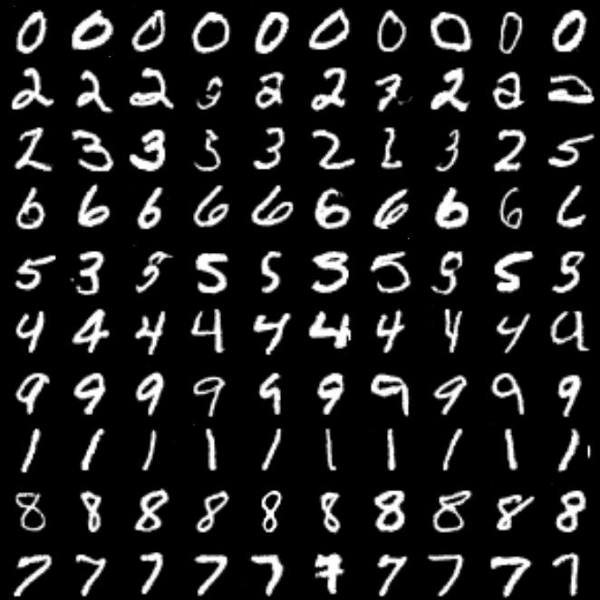
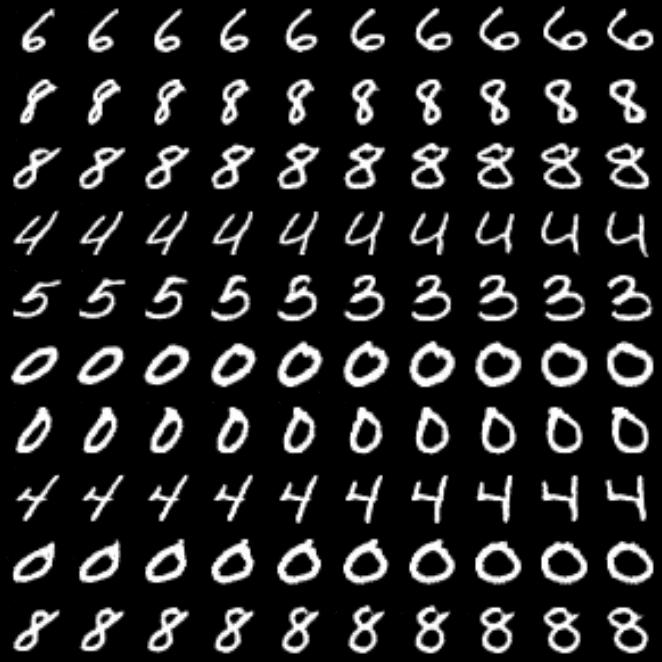
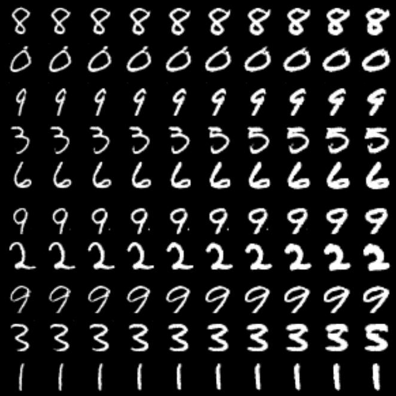
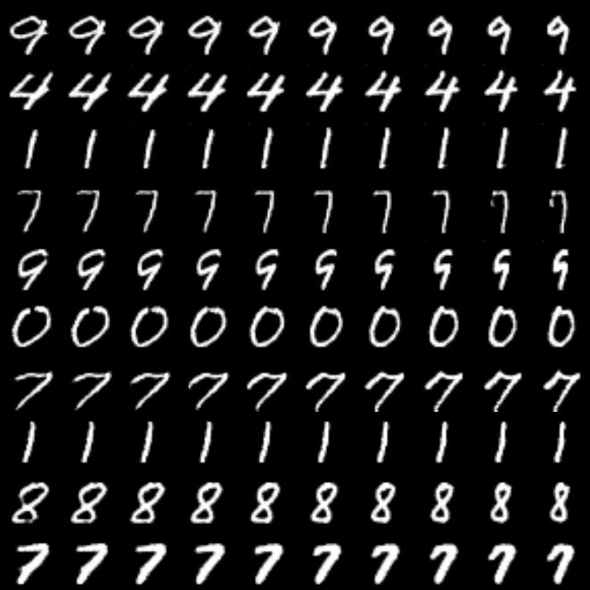

# InfoGAN

This is a pytorch implementation of [InfoGAN](https://papers.nips.cc/paper/6399-infogan-interpretable-representation-learning-by-information-maximizing-generative-adversarial-nets).

This repository has the following features that others do not have:

- Highly customizable.
  - You can use this for your own dataset, settings.
  - Most parameters including the latent variable design can be customized by editing the yaml config file.

- OK clean, structured codes
  - This is totally my personal point of view. :wink:

- [TensorBoard](https://www.tensorflow.org/tensorboard) is available by default.

## Result

### on MNIST dataset

- latent variable design
  - `z` ~ N(0, 1), 64 dimensions
  - `c1` ~ Cat(K=10, p=0.1)
  - `c2`, `c3`, `c4` ~ N(0, 1)
- `batchsize`: 300, `epochs`: 500 
- [mnist.yaml](configs/mnist.yaml)


<table style="width: 80%; margin: 0 auto; text-align: center;">
  <tr>
  	<th style="text-align: center;">c1 (digit type)</th>
  	<th style="text-align: center;">c2 (rotation)</th>
  </tr>
  <tr>
    <td></td>
    <td></td>
  </tr>
</table>

<table style="width: 80%; margin: 0 auto; text-align: center;">
  <tr>
  	<th style="text-align: center;">c3 (line thickness)</th>
  	<th style="text-align: center;">c4 (digit width)</th>
  </tr>
  <tr>
    <td></td>
    <td></td>
  </tr>
</table>

## Prerequisites

- Python (`~3.6`)

## Getting Started

```sh
make setup
```

- Start training

  ```sh
  python src/train.py --config <config.yaml>
  ```

  You need to specify all of training settings with `yaml` fromat. Example files are placed under `configs/`.

  If you want to try training anyway, my configuration for debugging is available.

  ```sh
  make debug
  ```

- Open tensorboard

  ```sh
  make tb
  ```
  Training metrics (ex. loss) are printed on console and tensorboard.

  By default, tensorboard watches `./results` directory. To change the path, execute `tensorboard --logdir <path>` or edit `Makefile`.


## TODO

- [ ] upload result on MNIST dataset.
- [ ] upload result on Fashion-MNIST dataset.
- [ ] automatic hyper-parameters tuning with Optuna.
